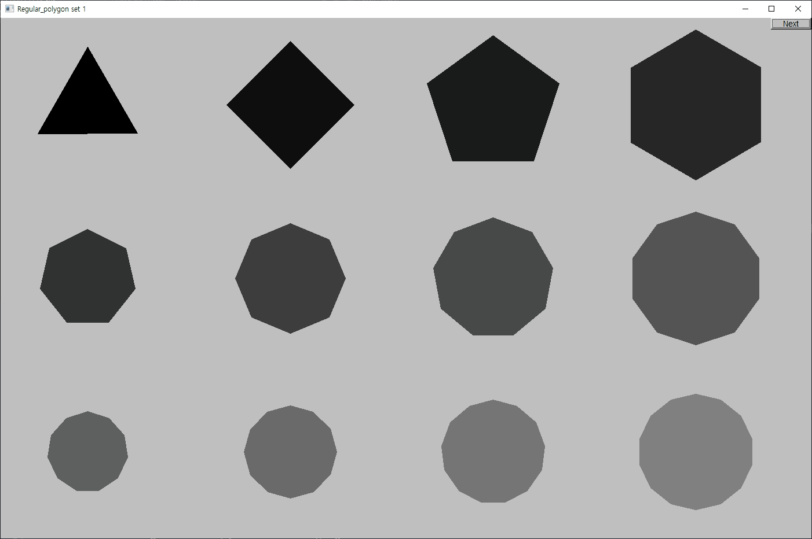

# Chapter 13

## Drill

- [drill13.cpp](./drill13.cpp)

  

## Exercises

1.  Define a class **Arc**, which draws a part of an ellipse.

    [exercise13_01.cpp](./exercise13_01.cpp)

    

2.  Draw a box with rounded corners. Define a class **Box**, consisting of four lines and four arcs.

    [exercise13_02.cpp](./exercise13_02.cpp)

    

3.  Define a class **Arrow**, which draws a line with an arrowhead.

    [exercise13_03.cpp](./exercise13_03.cpp)

    

4.  Define functions _n()_, _s()_, _e()_, _w()_, _center()_, _ne()_, _se()_, _sw()_, and _nw()_. Each takes a **Rectangle** argument and returns a **Point**. These functions define "connection points" on and in the rectangle. For example, _nw(r)_ is the northwest (top left) corner of a **Rectangle** called _r_.

    [exercise13_04.cpp](./exercise13_04.cpp)

    

5.  Define the functions from exercise 4 for a **Circle** and an **Ellipse**. Place the connection points on or outside the shape but not outside the bounding rectangle.

    [exercise13_05.cpp](./exercise13_05.cpp)

    

    

6.  Write a program that draws a class diagram like the one in §12.6. It will simplify matters if you start by defining a **Box** class that is a rectangle with a text label.

    [exercise13_06.cpp](./exercise13_06.cpp)

    

7.  Make an RGB color chart.

    [exercise13_07.cpp](./exercise13_07.cpp)

    

8.  Define a class **Regular_hexagon**. Use the center and the distance from the center to a corner point as constructor arguments.

    [exercise13_08.cpp](./exercise13_08.cpp)

    

9.  Tile a part of a window with **Regular_hexagon**s (use at least eight hexagons).

    [exercise13_09.cpp](./exercise13_09.cpp)

    

10. Define a class **Regular_polygon**. Use the center, the number of sides (>2), and the distance from the center to a corner as constructor arguments.

    [exercise13_10.cpp](./exercise13_10.cpp)

    

11. Draw a 300-by-200-pixel ellipse. Draw a 400-pixel-long x axis and a 300-pixel-long y axis through the center of the ellipse. Mark the foci. Mark a point on the ellipse that is not on one of the axes. Draw the two lines from the foci to the point.

    [exercise13_11.cpp](./exercise13_11.cpp)

    

12. Draw a circle. Move a mark around on the circle (let it move a bit each time you hit the "Next" button).

    [exercise13_12.cpp](./exercise13_12.cpp)

    

13. Draw the color matrix from §13.10, but without lines around each color.

    [exercise13_13.cpp](./exercise13_13.cpp)

    

14. Define a right triangle class. Make an octagonal shape out of eight right triangles of different colors.

    [exercise13_14.cpp](./exercise13_14.cpp)

    

    [exercise13_14extra.cpp](./exercise13_14extra.cpp)

    

    

15. "Tile" a window with small right triangles.

    [exercise13_15.cpp](./exercise13_15.cpp)

    

16. Do the previous exercise, but with hexagons.

    [exercise13_16.cpp](./exercise13_16.cpp)

    

17. Do the previous exercise, but using hexagons of a few different colors.

    [exercise13_17.cpp](./exercise13_17.cpp)

    

18. Define a class **Poly** that represents a polygon but checks that its points really do make a polygon in its constructor.

    [exercise13_18.cpp](./exercise13_18.cpp)

    

19. Define a class **Star**. One parameter should be the number of points. Draw a few stars with differing numbers of points, differing line colors, and differing fill colors.

    [exercise13_19.cpp](./exercise13_19.cpp)

    

## Wisdom

> The member c is initialized by each constructor. You could argue that **c** is too short and too obscure a name to use, but since it is used only within the small scope of **Color** and not intended for general use, that’s probably OK. We made the member **c** private to protect it from direct use from our users.
>
> _Bjarne, Stroustrup. Programming (p. 452). Pearson Education. Kindle Edition._

## Postscript

> [Chapter 12](https://github.com/spero61/ppp2/blob/main/chapter12/README.md) showed how to be a user of classes. This chapter moves us one level up the “food chain” of programmers: here we become tool builders in addition to being tool users.
>
> _Bjarne, Stroustrup. Programming (p. 485). Pearson Education. Kindle Edition._
