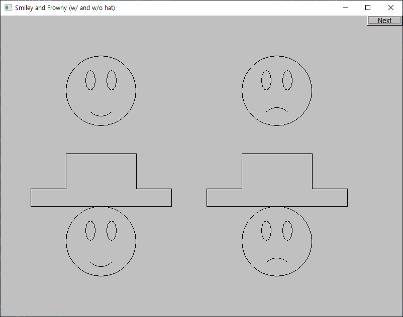

# Chapter 14

## Drill 14

- [drill14.md](./drill14.md)

## Selected Exercises

1. [exercise14_01.cpp](./exercise14_01.cpp)

   

2. [exercise14_05.cpp](./exercise14_05.cpp)

   

3. [exercise14_06.cpp](./exercise14_06.cpp)

   

4. [exercise14_07.cpp](./exercise14_07.cpp)

   

5. [exercise14_08.cpp](./exercise14_08.cpp)

   

6. [exercise14_09.cpp](./exercise14_09.cpp)

   

7. [exercise14_10.cpp](./exercise14_10.cpp)

   

8. [exercise14_11.cpp](./exercise14_11.cpp)

   

9. [exercise14_12.cpp](./exercise14_12.cpp)

   

10. [exercise14_13.cpp](./exercise14_13.cpp)

    

11. [exercise14_14.cpp](./exercise14_14.cpp)

    

12. [exercise14_15.cpp](./exercise14_15.cpp)

    

13. [exercise14_16.cpp](./exercise14_16.cpp)

    

14. [exercise14_17.cpp](./exercise14_17.cpp)

    

## Wisdom

> Basically, class hierarchies plus pass-by-reference and default copying do not mix. When you design a class that is meant to be a base class in a hierarchy, disable its copy constructor and copy assignment using **=delete** as was done for **Shape**.
>
> _Bjarne, Stroustrup. Programming (p. 504). Pearson Education. Kindle Edition._

## Postscript

> **Class**es, **encapsulation** (as supported by _private_ and _protected_), **inheritance** (as supported by _class derivation_), and **run-time polymorphism** (as supported by *virtual function*s) are among our most powerful tools for structuring systems.
>
> _Bjarne, Stroustrup. Programming (p. 518). Pearson Education. Kindle Edition._
