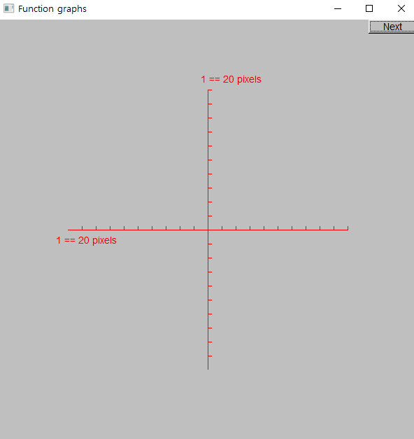
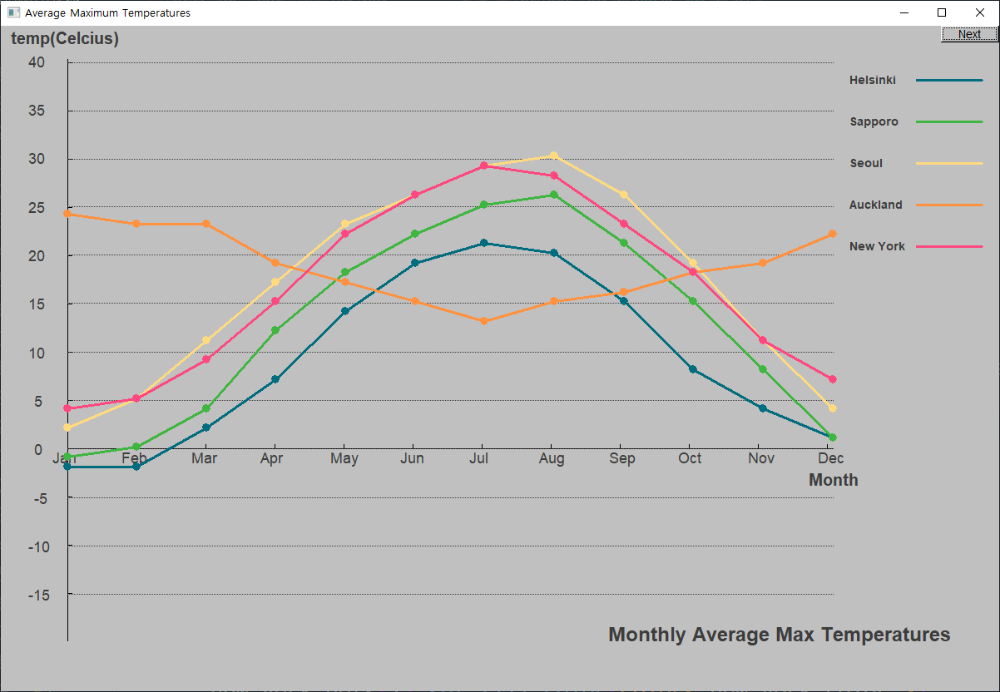

# Chapter 15

## Textbook examples

- [Function graphing](./book15_01.cpp)

  

- [Approximation](./book15_02.cpp)

  **int fac()** produces values that can't be stored in an **int**

  

  > **Remember, the computer's arithmetic is not pure math.**
  > Floating-point numbers are simply as good an approximation to real numbers as we can get with a fixed number of bits. An int overflows if you try to place a too-large integer in it, whereas a double stores an approximation.
  >
  > _Bjarne, Stroustrup. Programming (p. 537). Pearson Education. Kindle Edition._

  fix: change **int fac()** to **double fac()**

  

- [Graphing data: Aging Japan](./book15_03.cpp) \(_Input file_: [japanese-age-data.txt](./japanese-age-data.txt)\)

  

### Bonus

- [Bonus: Aging Japan in more detail](./book15_04_jp.cpp) \(_Input file_:\_ [japanese-age-data-detail.txt](./japanese-age-data-detail.txt)\)

  

- [Bonus: Aging Korea](./book15_04_kr.cpp) \(_Input file_: [korean-age-data-detail.txt](./korean-age-data-detail.txt)\)

  

## Drill 15

- [Function graphing drill with 'Shape's](./drill15_01.cpp)

  

- [Class definition drill](./drill15_02.cpp)

- [Class definition drill. 9). the last one](./drill15_03.cpp)

## Exercises \( _few are without screenshots_ \)

1. [exercise15_01.cpp](./exercise15_01.cpp)

   calculate factorial numbers using **_iterative_** and **_recursive_**

2. [exercise15_02.cpp](./exercise15_02.cpp)

3. [exercise15_03.cpp](./exercise15_03.cpp)

4. [exercise15_04.cpp](./exercise15_04.cpp)

   

5. [exercise15_05.cpp](./exercise15_05.cpp)

   

   [exercise15_05bonus.cpp](./exercise15_05.cpp)

   

6. [exercise15_06.cpp](./exercise15_06.cpp)

   

7. [exercise15_07.cpp](./exercise15_07.cpp)

   

8. [exercise15_08.cpp](./exercise15_08.cpp) \(_Input file_: [heights-data.txt](./heights-data.txt)\)

   

9. [exercise15_09.cpp](./exercise15_09.cpp) \(_Input file_: [korean-age-data-detail.txt](./korean-age-data-detail.txt)\)

   

10. [exercise15_10.md](./exercise15_10.md)

11. [exercise15_11.cpp](./exercise15_11.cpp) \(_Input file_: [temperature-data.txt](./temperature-data.txt)\)

    

## Wisdom

> We left these blemishes so that we could mention them — there are always more aesthetic details that we can work on. One part of a programmer’s art is to know when to stop and use the time saved on something better \(such as learning new techniques or sleep\).
>
> Remember: _"The best is the enemy of the good."_
>
> _Bjarne, Stroustrup. Programming (p. 524). Pearson Education. Kindle Edition._

> Specifying the return type for a lambda expression is rarely necessary. The main reason for that is that lambda expressions should be kept simple to avoid becoming a source of errors and confusion. If a piece of code does something significant, it should be given a name and probably requires a comment to be comprehensible to people other than the original programmer. We recommend using named functions for anything that doesn’t easily fit on a line or two.
>
> _Bjarne, Stroustrup. Programming (p. 529). Pearson Education. Kindle Edition._

## Postscript

> Most people, when they need to draw a graph, use someone else's code — a library. How are such libraries constructed and what do you do if you don't have one handy? What are the fundamental ideas underlying "an ordinary graphing tool"? Now you know: it isn't magic or brain surgery.
>
> _Bjarne, Stroustrup. Programming (p. 549). Pearson Education. Kindle Edition._
