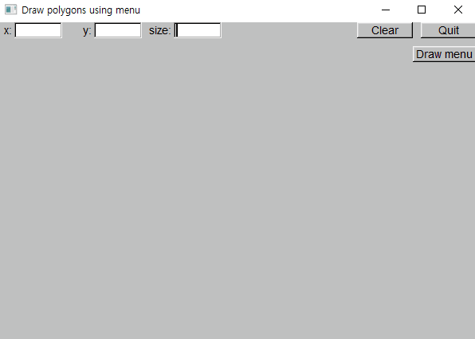

# Chapter 16

## Drill 16

- [a line-drawing program](./drill16_02.cpp)

  

- [a pop-up menu](./drill16_03.cpp)

  

- [a second menu](./drill16_04.cpp)

  

## Exercises

1. [exercise16_01.cpp](./exercise16_01.cpp)

   

2. [exercise16_02.cpp](./exercise16_02.cpp)

   

3. [exercise16_03.cpp](./exercise16_03.cpp)

   

4. [exercise16_04.cpp](./exercise16_04.cpp)

   

5. [exercise16_05.cpp](./exercise16_05.cpp)

   

6. [exercise16_06.cpp](./exercise16_06.cpp)

   

7. [exercise16_07.cpp](./exercise16_07.cpp)

   

8. [exercise16_08.cpp](./exercise16_08.cpp) \(_Input file_: [exchange rates](./exercise16_08_input.txt)\)

   

9. [exercise16_09.cpp](./exercise16_09.cpp)

   

10. [exercise16_10.cpp](./exercise16_10.cpp)

    

## Wisdom

> GUI is a form of I/O, and separation of the main logic of an application from I/O is among our major ideals for software. Wherever possible, we prefer to have a clean interface between our main program logic and the parts of the program we use to get input and produce output.
>
> Such a separation allows us to change the way a program is presented to a user, to port our programs to use different I/O systems, and — most importantly — to think about the logic of the program and its interaction with users separately.
>
> _Bjarne, Stroustrup. Programming (p. 553). Pearson Education. Kindle Edition._

> One implication of this "**control inversion**" is that the order of execution is completely determined by the actions of the user. This complicates both program organization and debugging. It is hard to imagine what a user will do and hard to imagine every possible effect of a random sequence of callbacks. This makes systematic testing a nightmare.
>
> _Bjarne, Stroustrup. Programming (p. 570). Pearson Education. Kindle Edition._
